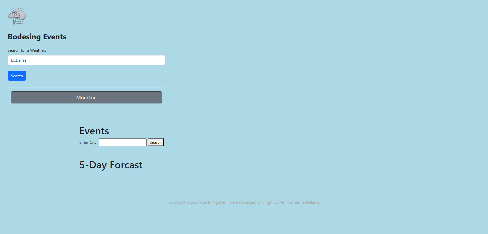
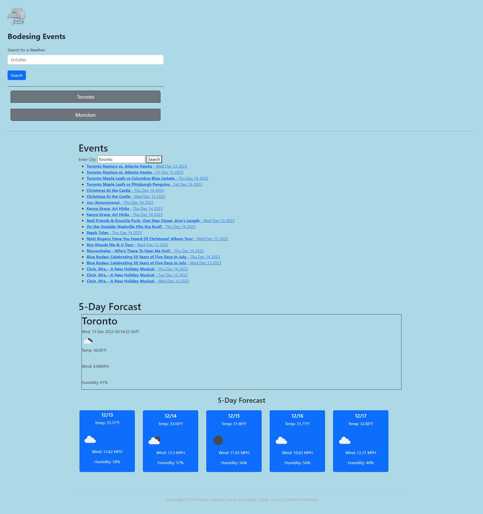

# BODESING Event Planner

## Description

As a team we have created an application that allows users to search the current weeks events and weather forecast for their chosen city

## Table of Contents

- [User Story](#userstory)
- [Acceptance Criteria](#acceptancecriteria)
- [Screenshots & Demo](#screenshotanddemo)
- [Deployment](#depolyment)
- [Installation](#installation)
- [Usage](#usage)
- [Future Deployment](#futuredeployment)
- [Credits](#credits)

## User Story

AS coding boot camp students
WE WANT to create an application that displays weather and events
SO THAT users can make informed decisions about which events to attend

## Acceptance Criteria

- It is done when the user…
- GIVEN I am interested in finding the perfect day for an event
- WHEN I enter in the city name and click the submit button
- THEN I am presented with the event information on one top
- THEN I am presented with the weather information on the bottom
- IT is done when I have…
- WHEN I have have used two APIs
- WHEN I have used modals
- WHEN I have used CSS frameworks
- WHEN it has been deployed on GitHub Pages
- WHEN it is interactive (responding to the requests)
- WHEN I have not used alerts, confirms, or prompts
- WHEN I have used client-side storage for persistent data
- WHEN it is responsive in a smooth transistion
- WHEN it has a UI that is appealing
- WHEN it has a clean repository that meets quality coding standards (file structure, naming conventions, follows best practices for class/id-naming conventions, indentation, quality comments, etc.)
- WHEN it has a quality README (with unique name, description, technologies used, screenshot, and link to deployed application)
- IT is done when we have…
- GIVEN we are interested in deploying this application
- WHEN we have completed our application
- THEN we will create a presentation to showcase it
- WHEN we create the presentation
- THEN we will address the following concepts:
  - Our user story
  - Motivations for the project
  - Technologies used
  - Task delgation
  - Challenges and Successes
  - Future Deployment
- THEN we will demonstrate how our application functions
- THEN we will list our deployed link and repository link

## Screenshots & Demo

Before Search

After the search

Demo video
[Demo Video](127.0.0.1_5500_indexNew1.mp4)

## Deployment

https://kzefram.github.io/BODESING-Events/

## Installation

There is no installation needed as this is a web application.

## Usage

The purpose of this website is to make sure users are given information about the current week's events and weather to ensure that they can make the best decision about which event to go to and how to best prepare for that event. On this site, we have utilized the knowledge we have learned through our studies. In this project we will use: HTML, CSS, APIs, jquery and JavaScript.

## Future Development

- Personalized User Profiles and Recommendations: Develop a feature for users to create profiles, where they can input their interests, such as music genres, sports, or types of events they prefer. Use this data to offer tailored event recommendations
- Advanced Event Filtering and Sorting: Enhance the search functionality with comprehensive filters like event category, age restrictions, and accessibility options
- Social Integration and Community Building: Introduce social features like event sharing, where users can invite friends through the app or share events on social media platforms.
- Detailed Weather Forecasts: Expand the weather forecast feature to include alerts for severe weather conditions, hourly forecasts, and a 10-day outlook
- User Reviews and Ratings: Allow users to rate and review events they have attended. This feedback can help other users make informed decisions and improve the overall quality of event listings

## Credits

- Karen Bourgeois,
- Singh Gurvir,
- Austin Nguyen,
- Catherine Delaney,
- https://www.joshwcomeau.com/css/custom-css-reset/,
- EDx/UNB,
- Wow Coding Academy,
- Jeet Mukherjee - https://github.com/Jeet009/WeatherApp/tree/master
- Noahbtaylor -https://github.com/noahbtaylor/06-Server-Side-APIs.git
- Ianbenjohn-https://github.com/ianbenjohn/Project-1.git
